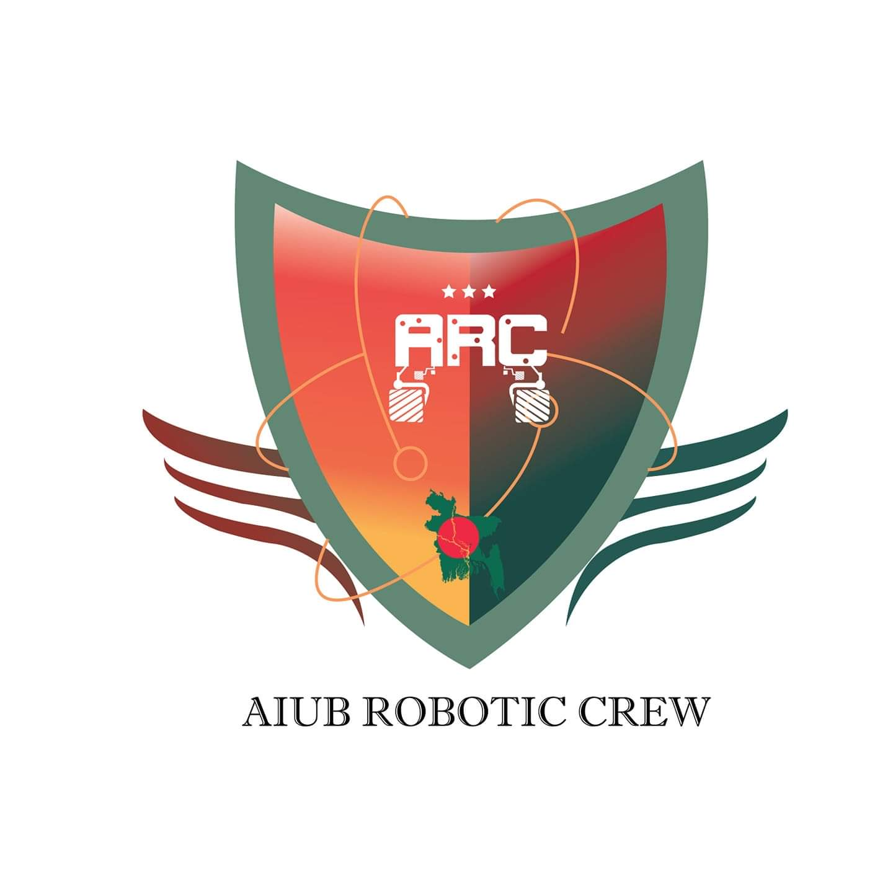

<!-- PROJECT LOGO -->
 

  

  <h1 align="center"> <strong> AIUB ROBOTIC CREW </strong> </h1>

  

    AIUB Robotic Crew (ARC) is a group of undergraduate students from American International University-Bangladesh (AIUB) who are passionate about the field 
    of robotics and its applications. The team was formed with the purpose to design and build the next generation of Mars rovers that will one day work alongside
    astronauts exploring the Red Planet.
     
    <a href="https://arc.aiub.edu/"><strong>Explore the website »</strong></a>
     
    <a href="https://www.youtube.com/watch?v=LRO5xW3Wr8Q&feature=emb_title&ab_channel=AIUBROBOTICCREW"> <h3> View Demo </h3> </a>
  

<!-- ABOUT THE PROJECT -->
## About The Project
_Our rover can complete four missions, which are given below respectively:_

1. Investigate a site for the presence of current or past life. 
2. Deliver a variety of objects to astronauts in the field across rugged terrain. 
3. Perform dexterous operations on a mock lander using a robotic arm. 
4. Autonomously travel to a series of locations.

<!-- LICENSE -->
## License

Distributed under the MIT License. See `LICENSE.txt` for more information.
     
     

<!-- CONTACT -->

<h3 align="center"> <strong> Contact the software team </strong> </h3>
 

    <a href="https://www.linkedin.com/in/parthoshaon/"> <strong> Partho Sarothi Roy </strong> </a>
    ·
    <a href="https://www.linkedin.com/in/mahabubul470/"> <strong> Mahabubul Hasan </strong> </a>
    ·
    <a href="https://www.linkedin.com/in/khaliduzzaman-mredul-b5ab93225/"> <strong> Khaliduzzaman Mredul </strong> </a>
 

(<a href="#readme-top">back to top</a>)

<!-- MARKDOWN LINKS & IMAGES -->
<!-- https://www.markdownguide.org/basic-syntax/#reference-style-links -->
[contributors-shield]: https://img.shields.io/github/contributors/othneildrew/Best-README-Template.svg?style=for-the-badge
[contributors-url]: https://github.com/othneildrew/Best-README-Template/graphs/contributors
[forks-shield]: https://img.shields.io/github/forks/othneildrew/Best-README-Template.svg?style=for-the-badge
[forks-url]: https://github.com/othneildrew/Best-README-Template/network/members
[stars-shield]: https://img.shields.io/github/stars/othneildrew/Best-README-Template.svg?style=for-the-badge
[stars-url]: https://github.com/othneildrew/Best-README-Template/stargazers
[issues-shield]: https://img.shields.io/github/issues/othneildrew/Best-README-Template.svg?style=for-the-badge
[issues-url]: https://github.com/othneildrew/Best-README-Template/issues
[license-shield]: https://img.shields.io/github/license/othneildrew/Best-README-Template.svg?style=for-the-badge
[license-url]: https://github.com/othneildrew/Best-README-Template/blob/master/LICENSE.txt
[linkedin-shield]: https://img.shields.io/badge/-LinkedIn-black.svg?style=for-the-badge&logo=linkedin&colorB=555
[linkedin-url]: https://linkedin.com/in/othneildrew
[product-screenshot]: images/softTeam.png
[Next.js]: https://img.shields.io/badge/next.js-000000?style=for-the-badge&logo=nextdotjs&logoColor=white
[Next-url]: https://nextjs.org/
[React.js]: https://img.shields.io/badge/React-20232A?style=for-the-badge&logo=react&logoColor=61DAFB
[React-url]: https://reactjs.org/
[Vue.js]: https://img.shields.io/badge/Vue.js-35495E?style=for-the-badge&logo=vuedotjs&logoColor=4FC08D
[Vue-url]: https://vuejs.org/
[Angular.io]: https://img.shields.io/badge/Angular-DD0031?style=for-the-badge&logo=angular&logoColor=white
[Angular-url]: https://angular.io/
[Svelte.dev]: https://img.shields.io/badge/Svelte-4A4A55?style=for-the-badge&logo=svelte&logoColor=FF3E00
[Svelte-url]: https://svelte.dev/
[Laravel.com]: https://img.shields.io/badge/Laravel-FF2D20?style=for-the-badge&logo=laravel&logoColor=white
[Laravel-url]: https://laravel.com
[Bootstrap.com]: https://img.shields.io/badge/Bootstrap-563D7C?style=for-the-badge&logo=bootstrap&logoColor=white
[Bootstrap-url]: https://getbootstrap.com
[JQuery.com]: https://img.shields.io/badge/jQuery-0769AD?style=for-the-badge&logo=jquery&logoColor=white
[JQuery-url]: https://jquery.com 
